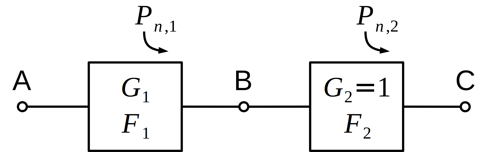

# Overall noise figure and ADC noise floor
A document to derive the overall noise figure degradation givent the ADC noise floor

The purpose of this document is to try to find the formula that is behind the following statement : 
> Given the conversion gain and noise figure previously stated, the noise spectral density (NSD) at the
ADC input is -131 dBm/Hz (-174 + 40 + 3). 
This assumes that noise outside the Nyquist band of the ADC is filtered using antialiasing filters to prevent front-end thermal noise from aliasing when sampled by the ADC. 
If the ADC noise floor is 10 dB below that of the front-end noise, it contributes about 0.1 dB to the overall NF of the receiver.

This paragraph can be found in :  
[Multicarrier WCDMA Feasibility Application Note (AN-807)](https://www.analog.com/media/en/technical-documentation/application-notes/58327589985769549305955624592an_807_0.pdf)
by Brannon, Brad, and Bill Schofield.

or : 
[Multicarrier WCDMA Feasibility, Part 1, By Brad Brannon and Bill Schofield, Analog Devices, Inc.  08.15.2007](https://www.eetimes.com/multicarrier-wcdma-feasibility-part-1/)

## Sytem diagram

## Definitions

SNR : 
- $SNR_A = \frac{P_{s,A}}{P_{n,A}} $
- $SNR_B = \frac{P_{s,B}}{P_{n,B}} = \frac{G_1\cdot P_{s,A}}{G_1\cdot P_{n,A}+P_{n,1}}$
- $SNR_C = \frac{P_{s,C}}{P_{n,C}} = \frac{P_{s,B}}{P_{n,B}+P_{n,2}} = \frac{G_1\cdot P_{s,A}}{G_1\cdot P_{n,A}+P_{n,1}+P_{n,2}} $

Noise factor : 

- $ F_1 = \frac{SNR_A}{SNR_B} $ and using SNR definitions : $ F_1 = 1 + \frac{P_{n,1}}{G_1\cdot P_{n,A}} $ 
- $ F_2 = \frac{SNR_B}{SNR_C} $ and using SNR definitions : $ F_2 = 1 + \frac{P_{n,2}}{P_{n,B}} $ 
- $ F_{tot} = \frac{SNR_A}{SNR_C} $

## Notations

We assume that the noise power $P_{n,2}$ is a fraction of the input noise $P_{n,A}$ : 
$P_{n,2} = \frac{P_{n,A}}{\eta}$
$P_{n,2|dBm} = P_{n,A|dBm}-10\log_{10}\eta =  P_{n,A|dBm}-\eta_{dB}$

We denote $\rho >1 $ the noise factor degradation caused by block "2" : 
$F_{tot} = F_1 \cdot \rho $
$F_{tot|dB} = F_{1|dB} + 10\log_{10}\rho = F_{1|dB} + \rho_{dB}$

## Derivation

Let's consider : 
$ \frac{F_{tot}}{F_1} = \rho  $ which is also $ \frac{F_{tot}}{F_1} = 1 + \frac{F_2-1}{F_1 G_1} $ using the Friis' noise formula. 

We have therefore: 
$ 1 + \frac{F_2-1}{F_1 G_1} = \rho $

The term $F_1 G_1$ is: 
$F_1 G_1 =  \left( 1 + \frac{P_{n,1}}{G_1\cdot P_{n,A}} \right) \cdot G_1 = \frac{G_1\cdot P_{n,A} + P_{n,1}}{G_1\cdot P_{n,A}} \cdot G_1 = \frac{P_{n,B}}{P_{n,A}} $

The term $F_2-1$ is: 
$F_2-1 = 1 + \frac{P_{n,2}}{P_{n,B}} -1  = \frac{P_{n,2}}{P_{n,B}}$

Hence: 
$ 1 + \frac{P_{n,2}}{P_{n,B}} \cdot \frac{P_{n,A}}{P_{n,B}} = \rho $ and since $P_{n,2}$ is a fraction of $P_{n,A}$: 

$ 1 + \frac{1}{\eta} \frac{P_{n,A}^2}{P_{n,B}^2} = \rho $

From the SNR definition: 
$P_{n,B} = \frac{P_{s,B}}{SNR_B} = \frac{G_1 \cdot P_{s,A}}{SNR_B} = \frac{G_1 \cdot SNR_A \cdot P_{n,A}}{SNR_B} = G_1 \cdot F_1 \cdot P_{n,A}$

Therefore: 
$ 1 + \frac{1}{\eta} \frac{1}{(G_1 \cdot F_1)^2} = \rho $

Now in terms of dB: 
$ \rho_{dB} = 10\log_{10}\left( 1 + \frac{1}{\eta} \frac{1}{(G_1 \cdot F_1)^2} \right) = 10\log_{10}\left( 1 + \frac{1}{10^{\frac{\eta_{dB}}{10}}} \frac{1}{10^{2 \frac{G_{1|dB}+F_{1|dB}}{10}}} \right) = 10\log_{10}\left( 1 + \frac{1}{10^{\frac{\eta_{dB}}{10}+\frac{G_{1|dB}+F_{1|dB}}{5}}}  \right) $

### Numerical application
Let's consider (as mentioned in [AN-807] ) : 
- $\eta_{dB} = 10\,$dB
- $G_{1|dB} = 40\,$dB
- $F_{1|dB} = 3\,$dB

$\rho_{dB} = 10\log_{10}\left( 1 + \frac{1}{10^{\frac{10}{10}+\frac{40+3}{5}}}  \right) \approx 1.1 \times 10^{-9}\,$dB

However, from [AN-807], the expected degradation is $0.1\,$dB...